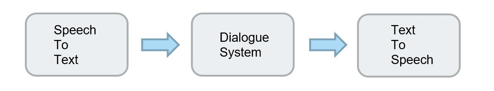

# ChatboxPi
---
- 2nd Round, 2019 AIoT Hackathon
- team member : Shu-Hsiang Yang, Sheng-Je Huang, Yu-Min Huang, Yi-Hsiang Chen
---
This is a Chinese voice assistance written on Raspberry pi.

+ flow chart  

