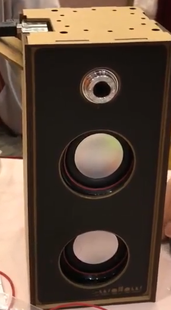

# ChatboxPi
---
- 2nd Round, 2019 AIoT Hackathon
- team member : Shu-Hsiang Yang, Sheng-Je Huang, Yu-Min Huang, Yi-Hsiang Chen
---
This is a Chinese voice assistance written on Raspberry pi.

The overall flow chart illustrated below.
+ flow chart  

The input voice is received by the microphone.
After the activation/trigger of the microphone.
The audio is recorded.
And then we use API from Chunghwa Telecom to transform the speech to text.
Given the input text, our dialogue system will act or reply.
The details in our dialogue system will be described in following section.
Next, we use another Chunghwa Telecom API transform the response to voice.
Finally, the voice will output fm the speaker.

---

+ The appearance of our chatbox

The upper part includes a camera ,raspberry pi, and a microphone.
The lower part includes two speakers.

---
Dialogue Systems

First, keywords will be detected in our dielogue system and the chatbox will give an appropriate response.
For example, if the keyword ,'photo', is detected in the sentence,
our chatbox will take a picture for you.
On the other hand, if there is no keyword in the sentence, our chatbox will chat with you casually.
We will choose most related reply from ptt bulletin board system.
The detail is described in https://github.com/zake7749/Chatbot.git

---

Functions
- take pictures
- chat
- tell you the temperature and PM2.5
- turn on/off the light
